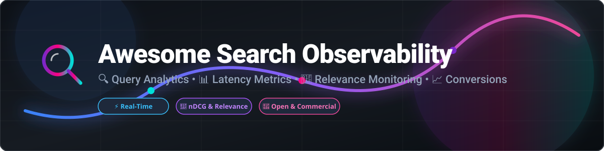

# 🔍 Awesome Search Observability 📊

### 🚀 Comprehensive Ecosystem of Search Analytics, Query Latency, Relevance Evaluation, and Conversion Observability Tools 📈

  
  
  
  
  

---

## 💡 Overview & Ecosystem

Welcome to **Awesome Search Observability** — a curated guide to commercial SaaS products and open-source GitHub projects designed for monitoring **search query performance**, **search relevance quality**, **zero-result rates**, **click-through position metrics (CTR)**, and **search-driven conversion attribution**.

Whether you are running **Elasticsearch**, **OpenSearch**, **Algolia**, **Meilisearch**, **Typesense**, or a custom search engine stack, this list covers the tooling necessary to diagnose latency bottlenecks, measure ranking quality with **nDCG / MAP**, track user click streams, and optimize site search ROI.

---

## 📑 Table of Contents

- [☁️ Commercial & SaaS Platforms](#️-commercial--saas-platforms)
- [🔓 Open-Source GitHub Projects](#-open-source-github-projects)
- [🛠️ How to Contribute](#️-how-to-contribute)
- [⚠️ Disclaimer](#️-disclaimer)
- [⭐ Star History](#-star-history)

---

## ☁️ Commercial & SaaS Platforms

Commercial and managed SaaS search solutions sorted by **Company Size / Valuation / Revenue (Descending)**:

| Product | Description | Company Size / Valuation / Revenue | Starting Tier Price | Free Tier / Trial Limits |
| :--- | :--- | :--- | :--- | :--- |
| **[Elastic Observability](https://www.elastic.co/observability)** | 🔭 Full-stack observability platform (logs, metrics, traces, APM) widely used to monitor Elasticsearch/OpenSearch clusters and search latency at scale. | **Public ($6.5B+ Market Cap, ~$1.5B+ Annual Revenue)** | Starts at **$95/mo** (Standard Hosted) | 14-day free trial |
| **[Algolia Analytics](https://www.algolia.com/)** | ⚡ Built-in search analytics covering query volume, click positions, conversion rates, no-result queries, and AI re-ranking insights. | **$2.3B Valuation (~$100M+ ARR)** | Pay-as-you-go Grow plan ($0/mo base + usage overages) | **Build Plan**: Free forever up to 10,000 search requests/mo & 100,000 records |
| **[Constructor Analytics](https://constructor.com/)** | 🛍️ E-commerce AI search and discovery platform focusing on conversion optimization, clickstream tracking, and revenue attribution analytics. | **$550M Valuation (Enterprise)** | Enterprise custom pricing | No free tier (4-week Proof Schedule assessment available) |
| **[Coveo Analytics](https://www.coveo.com/)** | 🧠 Enterprise AI search and recommendation platform providing deep analytics on relevance quality, merchandising, and customer intent. | **Public (~$300M Market Cap / EV, ~$130M Annual Revenue)** | Starts at **$990/mo** (Salesforce Pro+ package; enterprise contracts custom) | No free tier (proof-of-concept assessment available) |
| **[Swiftype Analytics](https://swiftype.com/)** | 🔍 Site search analytics providing search query metrics, autocomplete performance, and popularity ranking (by Elastic). | **Subsidiary of Elastic ($6.5B+ parent)** | Starts at **$79/mo** (Standard plan) | 14-day free trial |
| **[Searchspring](https://searchspring.com/)** | 🛒 E-commerce search and merchandising platform with analytics on search performance, zero-results, and revenue attribution. | **Private (~$25M Est. Revenue, merged into Athos Commerce / PSG funded)** | Starts at **$599/mo** (Essential plan) | No free tier or free trial (demos available) |
| **[Meilisearch Cloud](https://www.meilisearch.com/)** | ⚡ Managed cloud offering of the open-source Meilisearch engine with hosting, scaling, and operational analytics for production workloads. | **$22M+ VC Funding (Private)** | Starts at **$30/mo** | 14-day free trial |
| **[Bonsai Search Analytics](https://bonsai.io/)** | 🌲 Hosted Elasticsearch and OpenSearch cluster management with built-in search analytics and performance monitoring. | **Private (~$15M–$20M Est. Valuation)** | Starts at **$15/mo** (Standard/Staging plan) | Free developer staging plan available |
| **[Typesense Cloud](https://typesense.org/)** | ⚡ Managed cloud service for Typesense, providing hosting and operational visibility for instant search deployments. | **Private (~$4.3M Est. Valuation / ~$1.4M ARR)** | Hourly resource-based (starts at **~$7/mo** for small cluster configs) | **One-time Trial**: 720 hours (~30 days) cluster time + 10 GB bandwidth |
| **[Searchanise](https://searchanise.com/)** | 📊 Search and merchandising app for e-commerce platforms (Shopify, WooCommerce, BigCommerce) with query analytics and conversion reports. | **Private (~$2.8M ARR)** | Starts at **$19/mo** | **Free Plan**: Free forever up to 25 products, or 14-day free trial on paid plans |

---

## 🔓 Open-Source GitHub Projects

Top open-source search engines, relevance evaluation frameworks, and observability platforms sorted by **GitHub Star Count (Descending)**:

1. **[Elasticsearch](https://github.com/elastic/elasticsearch)**   
   🔎 *The industry-standard distributed search engine with extensive query logging, slow logs, APM instrumentation, and cluster performance monitoring tools.*

2. **[PostHog](https://github.com/PostHog/posthog)**   
   🦔 *Open-source product analytics platform used to capture search events, zero-result query tracking, click-through rates, and downstream conversion funnels.*

3. **[Meilisearch](https://github.com/meilisearch/meilisearch)**   
   ⚡ *Fast, open-source C++ / Rust search engine with typo tolerance, faceting, and built-in capabilities that teams instrument for query latency and search performance metrics.*

4. **[SigNoz](https://github.com/SigNoz/signoz)**   
   📈 *Open-source APM & Observability platform built on OpenTelemetry to monitor search API latency, error rates, trace search query requests, and monitor database bottlenecks.*

5. **[Typesense](https://github.com/typesense/typesense)**   
   🚀 *Open-source, fast, in-memory search engine designed as an Algolia alternative. Easily pairs with custom analytics pipelines to monitor search query volume.*

6. **[OpenSearch](https://github.com/opensearch-project/OpenSearch)**   
   🔎 *Apache 2.0 open-source search and analytics suite with a dedicated Observability plugin (logs, metrics, traces, dashboards, anomaly detection) for search clusters.*

7. **[OpenObserve](https://github.com/openobserve/openobserve)**   
   📊 *High-performance petabyte-scale cloud-native observability platform (logs, metrics, traces) for tracking search cluster logs and query performance at low storage cost.*

8. **[Matomo](https://github.com/matomo-org/matomo)**   
   📊 *Privacy-focused open-source web analytics platform with built-in Site Search tracking (keyword analytics, zero-results queries, search follow-ups).*

9. **[Apache Solr](https://github.com/apache/solr)**   
   ☀️ *Enterprise search platform built on Apache Lucene featuring query component metrics, slow query logging, and Prometheus exporter integration for search observability.*

10. **[Vespa](https://github.com/vespa-engine/vespa)**   
    🛡️ *Open-source big-data processing and vector search engine by Yahoo featuring real-time evaluation, query metrics, phase ranking evaluation, and telemetry endpoints.*

11. **[Ragas](https://github.com/explodinggradients/ragas)**   
    🧪 *Framework for evaluating Retrieval Augmented Generation (RAG) and search pipelines, measuring context precision, recall, and vector retrieval relevance.*

12. **[Phoquabs / Quepid](https://github.com/o19s/quepid)**   
    🎯 *Open-source search relevance evaluation and tuning platform. Enables human relevance judgment, tracking nDCG / MAP metrics across Elasticsearch, Solr, and OpenSearch.*

13. **[Raxe / Rekall](https://github.com/sony-mathew/rekall)**   
    📐 *Open-source Python framework for evaluating search relevance and ranking models by computing Mean Average Precision (MAP), DCG, and nDCG metrics.*

14. **[SearchTweak](https://github.com/searchtweak/searchtweak)**   
    🛠️ *Evaluation platform for search teams supporting human/AI judgments, nDCG tracking, and dataset creation for Learning-to-Rank algorithms.*

---

## 🛠️ How to Contribute

1. 🍴 Fork this repository.
2. 📝 Add or update entries in `README.md` following the established table / badge structure.
3. 📌 Ensure SaaS products include company size/valuation and starting price; ensure open-source entries include proper GitHub star badges.
4. 🔀 Submit a Pull Request with a clear description of your additions!

---

## ⚠️ Disclaimer

- This list is **community-curated** for search engineers, relevance teams, and product managers.
- Search observability encompasses query analytics, relevance quality (nDCG / MAP), infrastructure latency monitoring, and search conversion tracking.
- Always comply with privacy laws (GDPR/CCPA) when capturing user search queries and clickstream behavior.

---

## ⭐ Star History

<a href="https://www.star-history.com/?repos=ishandutta2007%2FAwesome-Search-Observability&type=date&legend=bottom-right">
<picture>
<source media="(prefers-color-scheme: dark)" srcset="https://api.star-history.com/chart?repos=ishandutta2007/Awesome-Search-Observability&type=date&theme=dark&legend=bottom-right" />
<source media="(prefers-color-scheme: light)" srcset="https://api.star-history.com/chart?repos=ishandutta2007/Awesome-Search-Observability&type=date&legend=bottom-right" />

</picture>
</a>

---

**Made with ❤️ for search engineers, relevance teams, and product organizations seeking transparent, controllable search insights.**  
Let's make search quality and performance measurable and open! 🚀